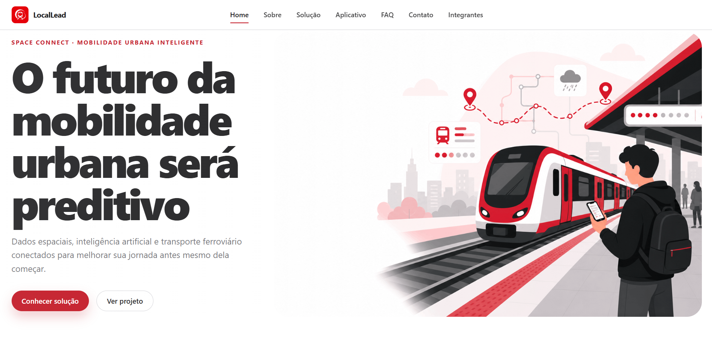
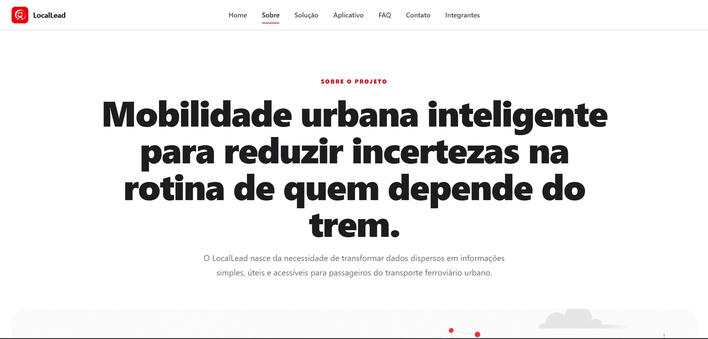
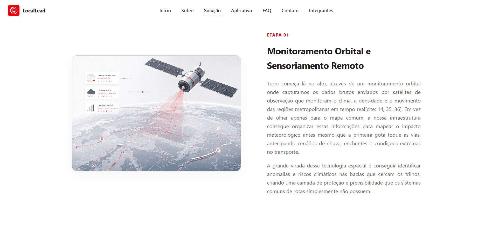
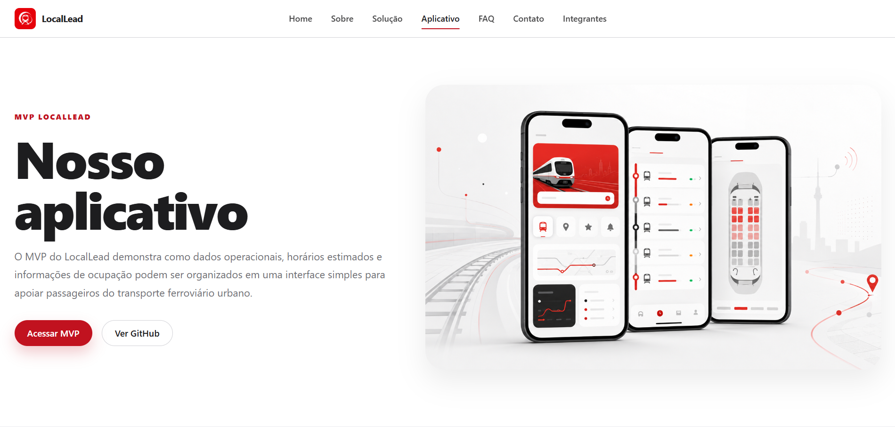
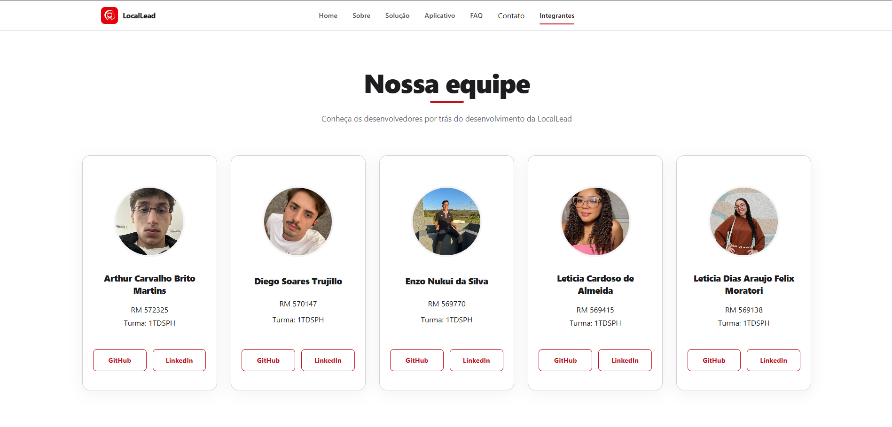
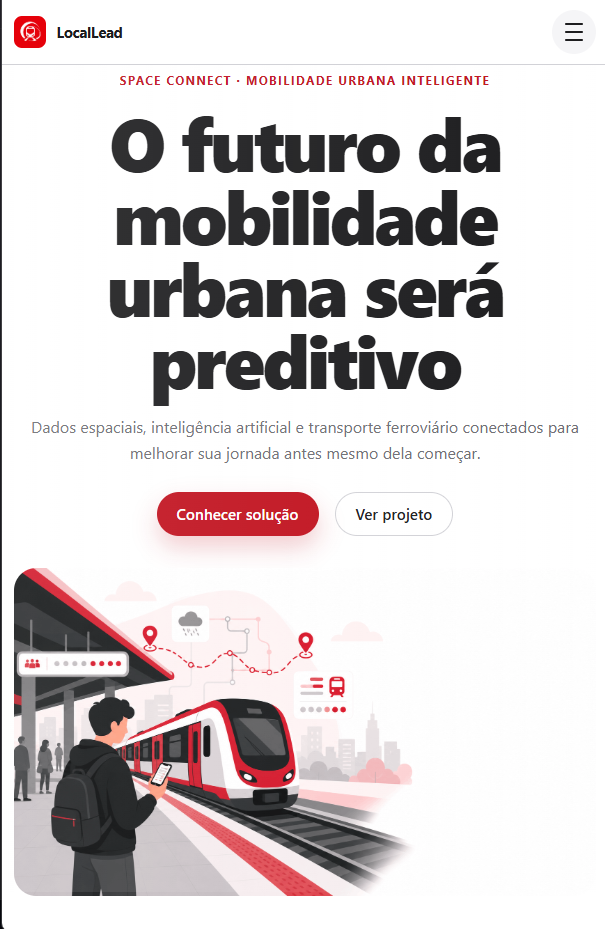
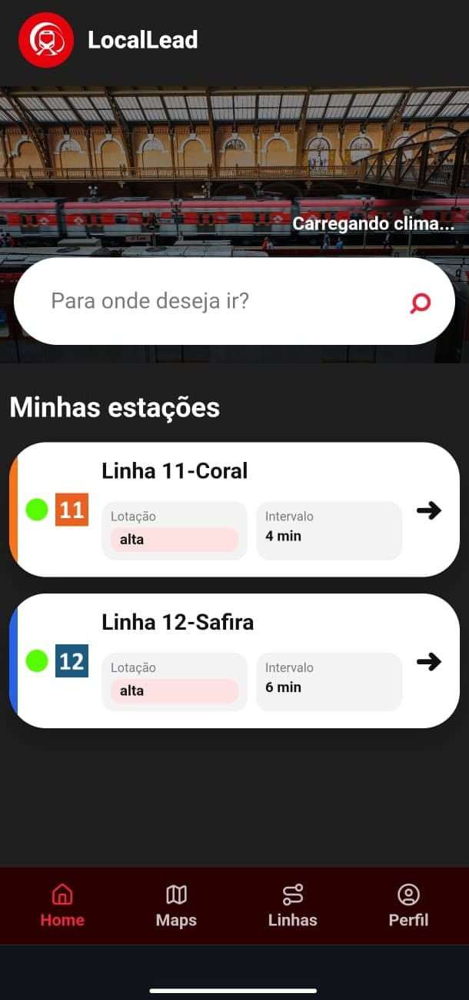

# LocalLead — Inteligência Espacial para Mobilidade Urbana

## Descrição do Projeto

O **LocalLead** é um site institucional desenvolvido para apresentar uma solução de mobilidade urbana inteligente criada para a **Global Solution FIAP 2026**. A proposta do projeto é demonstrar como dados espaciais, inteligência artificial, análise climática e informações ferroviárias podem contribuir para uma experiência mais previsível, clara e segura para passageiros do transporte urbano sobre trilhos.

O front-end foi desenvolvido com foco em uma comunicação visual moderna, limpa e tecnológica, apresentando o problema enfrentado pelos usuários, o conceito da solução, o funcionamento da proposta, o MVP do aplicativo, os integrantes do grupo e os canais de contato.

A identidade visual do projeto utiliza uma paleta baseada em vermelho, branco, cinza claro, cinza escuro e preto, buscando transmitir inovação, mobilidade, confiança e clareza visual.

---

## 🔗 Repositório

[](https://github.com/EnzoNukui/LocalLead)  
[https://github.com/EnzoNukui/LocalLead](https://github.com/EnzoNukui/LocalLead)

---

## 🌐 Link do Projeto

O front-end do projeto **LocalLead** está disponível para acesso público através do deploy na Vercel.

🔗 <a href="https://locallead-site.vercel.app/index.html" target="_blank"><strong>Acessar o site do LocalLead</strong></a>

---

## 🛠️ Tecnologias Utilizadas

O projeto foi desenvolvido utilizando tecnologias web nativas, priorizando organização, responsividade, semântica e facilidade de manutenção.

* **HTML5:** utilizado para estruturar as páginas, seções, navegação, conteúdos institucionais e elementos semânticos do site.
* **CSS3:** responsável pela identidade visual, responsividade, organização dos layouts, grids, cards, botões, header, footer e adaptação para diferentes tamanhos de tela.
* **JavaScript:** utilizado para adicionar interatividade ao site, principalmente no menu responsivo e em comportamentos dinâmicos da interface.
* **Git:** utilizado para controle de versão durante o desenvolvimento.
* **GitHub:** utilizado para hospedagem do código-fonte e colaboração entre os integrantes.
* **Vercel:** utilizada para publicação do projeto em ambiente web.

---

## 📸 Imagens e Representação do Projeto

As capturas abaixo demonstram as principais telas desenvolvidas no front-end do **LocalLead**, apresentando a identidade visual, a organização das páginas e a experiência responsiva do site.

### 🏠 1. Página Principal — Home

A página inicial apresenta a proposta central do LocalLead, destacando a mobilidade urbana inteligente, o uso de dados e a importância de oferecer mais previsibilidade para passageiros do transporte ferroviário.



### 🛰️ 2. Página Sobre

A página Sobre contextualiza o projeto, explicando o propósito da solução e a relação entre dados espaciais, inteligência artificial e transporte ferroviário urbano.



### ⚙️ 3. Página Solução

A página Solução apresenta o funcionamento conceitual da proposta, mostrando etapas como coleta de dados, processamento por inteligência artificial e distribuição de previsões acionáveis.



### 📱 4. Página Nosso Aplicativo

A página Nosso Aplicativo apresenta o MVP do LocalLead, suas principais telas, funcionalidades, limitações e tecnologias utilizadas no desenvolvimento da aplicação.



### 👥 5. Página Integrantes

A página Integrantes apresenta os desenvolvedores responsáveis pelo projeto, com nome, RM, turma e links para GitHub e LinkedIn.



### 📱 6. Experiência Responsiva — Mobile

O projeto foi desenvolvido para se adaptar a diferentes tamanhos de tela, reorganizando menus, imagens, textos, cards e botões para garantir boa usabilidade em dispositivos móveis.

| Home Mobile |
| :---: |
|  |

| Aplicativo Mobile |
| :---: |
|  |

---

## 🚀 Como Inicializar o Projeto

Como este repositório corresponde ao front-end institucional do **LocalLead**, não é necessário instalar dependências para visualizar o projeto localmente.

### 1. Clonar o repositório

```bash
git clone https://github.com/EnzoNukui/LocalLead.git
```

### 2. Acessar a pasta do projeto

```bash
cd LocalLead
```

### 3. Abrir o projeto no navegador

Abra o arquivo abaixo diretamente no navegador:

```text
index.html
```

Também é possível utilizar a extensão **Live Server** no Visual Studio Code para executar o projeto localmente com recarregamento automático.

### 4. Executando com Live Server

```text
1. Abra a pasta do projeto no VS Code
2. Clique com o botão direito no arquivo index.html
3. Selecione a opção "Open with Live Server"
```

---

---

## 📱 Como Inicializar o MVP do Aplicativo

Além do site institucional, o projeto também apresenta um **MVP funcional do aplicativo LocalLead**, desenvolvido para demonstrar a experiência mobile de consulta a linhas, horários estimados e informações de vagões.

O MVP está em um repositório separado:

🔗 [https://github.com/EnzoNukui/mvp_locallead](https://github.com/EnzoNukui/mvp_locallead)

---

### 1. Clonar o repositório do MVP

```bash
git clone https://github.com/EnzoNukui/mvp_locallead.git
```

### 2. Acessar a pasta do projeto

```bash
cd mvp_locallead
```

### 3. Instalar as dependências

Caso o projeto utilize Node.js no back-end, instale as dependências com:

```bash
npm install
```

Se o back-end estiver dentro de uma pasta específica, acesse essa pasta antes de instalar:

```bash
cd back-end
npm install
```

### 4. Inicializar o servidor

Para iniciar o servidor do MVP, utilize:

```bash
cd src
npm start
```

Caso o projeto esteja configurado para rodar diretamente pelo arquivo principal, utilize:

```bash
node server.js
```

### 5. Abrir o front-end do MVP

Após iniciar o servidor, abra o front-end do projeto no navegador. Se estiver utilizando o VS Code, recomenda-se abrir o arquivo principal com a extensão **Live Server**.

```text
1. Abra a pasta do MVP no VS Code
2. Localize o arquivo index.html do front-end
3. Clique com o botão direito
4. Selecione "Open with Live Server"
```

---

## 📍 Permissão de Localização

Para que o MVP funcione corretamente, é necessário permitir o acesso à localização do dispositivo quando o navegador solicitar.

Essa permissão é importante porque o LocalLead utiliza a localização do usuário para simular uma experiência mais contextualizada, permitindo que o sistema identifique melhor o ponto de partida e relacione a experiência do passageiro com o ambiente urbano ao redor.

Ao abrir o MVP no navegador, aceite a solicitação:

```text
Permitir que este site acesse sua localização?
```

Clique em:

```text
Permitir
```

Caso a localização seja bloqueada, algumas funcionalidades do MVP podem não funcionar corretamente ou apresentar informações menos precisas.

---

## ⚠️ Observações sobre o MVP

O MVP do LocalLead ainda possui limitações por se tratar de uma primeira versão acadêmica da solução.

* A localização do usuário depende da permissão concedida no navegador.
* O projeto ainda não utiliza GPS real dos trens.
* As previsões são estimadas com base em regras internas e dados disponíveis.
* Algumas informações podem depender da disponibilidade de APIs externas.
* A visualização de ocupação dos vagões representa uma proposta de funcionamento.

---

## 📁 Estrutura de Pastas do Projeto

A arquitetura do repositório foi organizada para separar recursos visuais, folhas de estilo, scripts e páginas internas, facilitando a manutenção e evolução do projeto.

```text
LocalLead/
├── assets/
│   ├── favicon/
│   │   └── favicon.ico
│   ├── img/
│   │   ├── app/
│   │   │   ├── app-home.jpg
│   │   │   ├── app-horarios-linha.jpg
│   │   │   ├── app-mockup-principal.png
│   │   │   └── app-vagoes.jpg
│   │   ├── apresentacao/
│   │   │   ├── aplicativo-desktop.png
│   │   │   ├── home-desktop.png
│   │   │   ├── home-mobile.png
│   │   │   ├── integrantes-desktop.png
│   │   │   ├── sobre-desktop.png
│   │   │   └── solucao-desktop.png
│   │   ├── home/
│   │   │   ├── cta-cidade-conectada-compresso.png
│   │   │   ├── fluxo-satélite-ia-cidade-compresso.png
│   │   │   ├── hero-trem-cidade-compresso.png
│   │   │   ├── mockup-locaallead-app-compresso.png
│   │   │   ├── problema-chuva-compresso.png
│   │   │   ├── problema-espera-compresso.png
│   │   │   ├── problema-lotacao-compresso.png
│   │   │   ├── publico-estudantes-compresso.png
│   │   │   ├── publico-passageiros-compresso.png
│   │   │   └── publico-trabalhadores-compresso.png
│   │   ├── sobre/
│   │   │   ├── sobre-hero-contexto-urbano.png
│   │   │   ├── sobre-rede-urbana-inteligente.png
│   │   │   └── sobre-space-connect-conceito.png
│   │   ├── solucao/
│   │   │   ├── distribuicao.jpeg
│   │   │   ├── processamento.jpeg
│   │   │   └── satelite.jpeg
│   │   └── logo_locallead.png
│   └── integrantes/
│       ├── foto_arthur.jpg
│       ├── foto_diego.jpeg
│       ├── foto_enzo.jpeg
│       ├── foto_leticia_cardoso.jpeg
│       └── foto_leticia_dias.jpeg
├── css/
│   ├── apicativo.css
│   ├── base.css
│   ├── buttons.css
│   ├── cards.css
│   ├── contato.css
│   ├── faq.css
│   ├── footer.css
│   ├── hero.css
│   ├── home.css
│   ├── integrantes.css
│   ├── layout.css
│   ├── main.css
│   ├── menu.css
│   ├── sobre.css
│   └── solucao.css
├── js/
│   ├── contato.js
│   ├── faq.js
│   ├── main.js
│   ├── menu.js
│   └── solucao.js
├── paginas/
│   ├── aplicativo.html
│   ├── contato.html
│   ├── faq.html
│   ├── integrantes.html
│   ├── sobre.html
│   └── solucao.html
├── index.html
└── readme.md
```

---

## 🎨 Organização Visual e Responsividade

O CSS do projeto foi separado em arquivos modulares, facilitando a organização dos estilos por responsabilidade. O arquivo `main.css` centraliza os imports dos demais arquivos, enquanto cada página possui um CSS específico para seus componentes principais.

A responsividade foi planejada para adaptar o layout em diferentes tamanhos de tela, reorganizando grids, imagens, menus, cards e botões. No mobile, o menu tradicional é substituído por um menu hambúrguer, e as seções passam a ter uma leitura vertical mais confortável.

---

## 👥 Autores e Créditos

Conheça os desenvolvedores responsáveis pela idealização e desenvolvimento do projeto **LocalLead**:

<table>
  <thead>
    <tr>
      <th>Nome do Integrante</th>
      <th>RM</th>
      <th>Turma</th>
      <th>LinkedIn</th>
      <th>GitHub</th>
    </tr>
  </thead>
  <tbody>
    <tr>
      <td>Arthur Carvalho Brito Martins</td>
      <td>RM 572325</td>
      <td>1TDSPH</td>
      <td><a href="https://www.linkedin.com/in/arthur-martinss/">LinkedIn</a></td>
      <td><a href="https://github.com/arthurmartinss">GitHub</a></td>
    </tr>
    <tr>
      <td>Diego Soares Trujillo</td>
      <td>RM 570147</td>
      <td>1TDSPH</td>
      <td><a href="https://www.linkedin.com/in/diego-trujillo-3441b9380/">LinkedIn</a></td>
      <td><a href="https://github.com/diegotrujillo011">GitHub</a></td>
    </tr>
    <tr>
      <td>Enzo Nukui da Silva</td>
      <td>RM 569770</td>
      <td>1TDSPH</td>
      <td><a href="https://www.linkedin.com/in/enzo-nukui/">LinkedIn</a></td>
      <td><a href="https://github.com/EnzoNukui">GitHub</a></td>
    </tr>
    <tr>
      <td>Leticia Cardoso de Almeida</td>
      <td>RM 569415</td>
      <td>1TDSPH</td>
      <td><a href="https://www.linkedin.com/in/let%C3%ADcia-almeida-70b851294/">LinkedIn</a></td>
      <td><a href="https://github.com/lehalmeidafc0">GitHub</a></td>
    </tr>
    <tr>
      <td>Leticia Dias Araujo Felix Moratori</td>
      <td>RM 569138</td>
      <td>1TDSPH</td>
      <td><a href="https://www.linkedin.com/in/leticia-felix-660253286">LinkedIn</a></td>
      <td><a href="https://github.com/LeticiaFelix18">GitHub</a></td>
    </tr>
  </tbody>
</table>

---

## ✉️ Contato e Suporte

Para dúvidas, sugestões ou informações sobre o projeto **LocalLead**, entre em contato pelos canais abaixo:

* 🐛 **Reporte de Bugs e Sugestões:** abra uma issue diretamente no repositório do projeto:  
[https://github.com/EnzoNukui/LocalLead/issues](https://github.com/EnzoNukui/LocalLead/issues)

* 🔗 **Repositório Oficial:**  
[https://github.com/EnzoNukui/LocalLead](https://github.com/EnzoNukui/LocalLead)

* ✉️ **Contato Direto:**  
[rm569770@fiap.com.br](mailto:rm569770@fiap.com.br)

---

## 📌 Status do Projeto

O projeto está em desenvolvimento acadêmico e faz parte da entrega da **Global Solution FIAP 2026**.

Atualmente, o repositório contém a estrutura front-end do site institucional, com páginas HTML, arquivos CSS modulares, scripts JavaScript e recursos visuais organizados em pastas específicas.

---

## 📄 Licença

Este projeto foi desenvolvido para fins acadêmicos.

O uso, reprodução ou adaptação do conteúdo deve respeitar os créditos dos autores e o contexto da entrega para a **Global Solution FIAP 2026**.